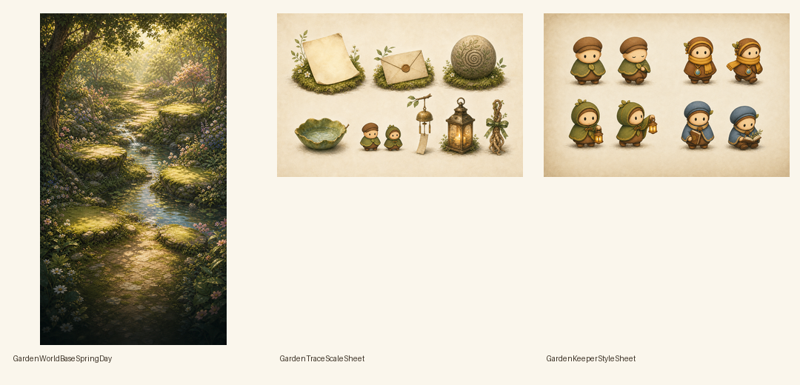

# Batch 1 Style Lock Review

Date: 2026-05-29

Generated with the built-in image generation tool and saved into this folder:

- `GardenWorldBaseSpringDay.png`
- `GardenTraceScaleSheet.png`
- `GardenKeeperStyleSheet.png`
- `Batch1StyleLockContactSheet.png`

## Decision

Batch 1 is good enough to guide the next generation batch, but not ready to ship directly.

The direction is stronger than the current app screenshot because the world now has clearer anchor surfaces, the trace objects share a more consistent material language, and the characters have richer shading that better matches the Garden background.

## GardenWorldBaseSpringDay

What works:

- Clear foreground path for keeper movement.
- Left lower, right lower, left mid, and right mid platforms are readable.
- Better bottom darkness for tab bar readability.
- No UI, labels, text, or visible task/reward language.

Issues before production:

- Needs exact 1290x2796 export or upscale/crop workflow.
- Needs a depth/anchor guide overlaid manually before implementation.
- Upper safe area is still visually busy, so header should stay minimal or move lower.

## GardenTraceScaleSheet

What works:

- Trace objects share contact shadows and material treatment.
- Paper, envelope, bowl, lantern, wind chime, and root charm are readable.
- Character scale reference makes the current app stone size problem obvious.

Issues before production:

- Memory stone should be smaller in app than shown here.
- Wind chime should only appear in hanging anchors.
- Root charm needs a stronger silhouette if used below 44 pt.

## GardenKeeperStyleSheet

What works:

- Keeper, Mira, Sol, and Nori now share palette, line weight, and lighting.
- Characters feel more integrated with the painterly world than the current sprites.
- Poses imply low-amplitude animation rather than reward-like bouncing.

Issues before production:

- Need real transparent sprite sheets, not parchment-background references.
- Need consistent frame boxes and foot contact points.
- Need arrival/gift/touch animations generated as separate batches.

## Next Batch

Proceed to Batch 2 only after using this style lock to prompt final assets:

1. `GardenWorldSpringDay` final background with exact anchor map.
2. `GardenWorldBaseSpringDepthGuide` with visual anchor overlays.
3. `GardenGroundShadowSoft01-06`.
4. `GardenSeasonSpringForeground`.

Do not replace app assets until the final background and depth guide are both accepted.
