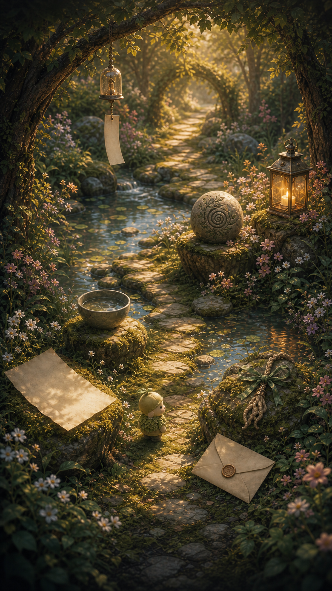
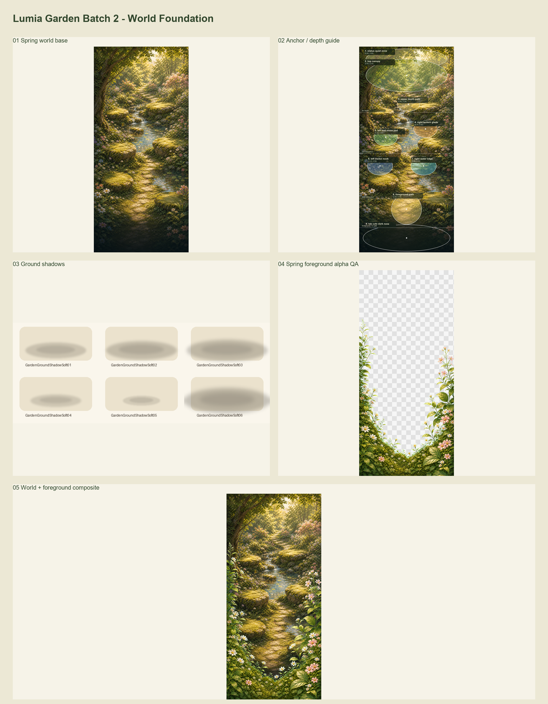
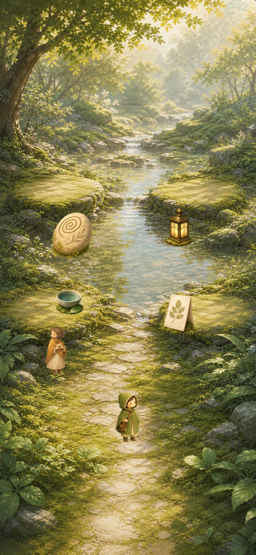
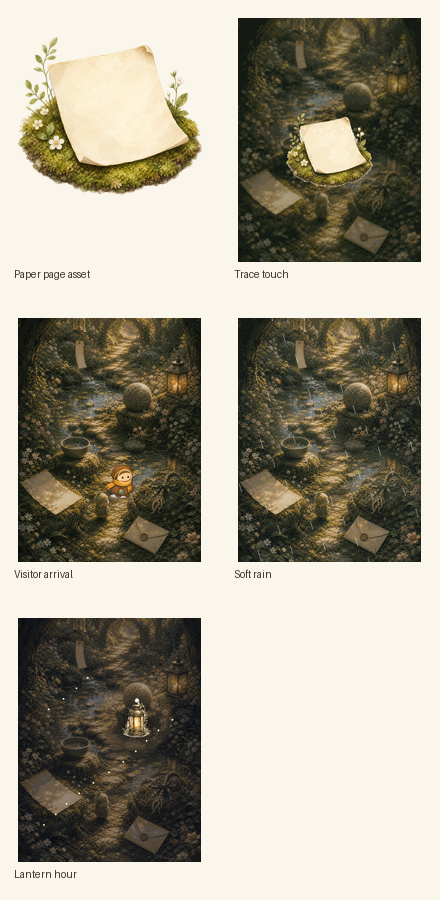

# Lumia Garden Content System

Generated reference image: `docs/garden/lumia-garden-world-reference.png`

Asset plan: `docs/garden/lumia_garden_asset_plan.md`

Asset manifest: `docs/garden/lumia_garden_asset_manifest.md`



## Product Positioning

Garden is not a task board, reward track, streak loop, or progress dashboard.

Garden is a visible memory layer for inner work that already happened in Journal, Therapy, Sanctuary, and Check-in. The user enters Garden to see traces of care, not to find more obligations.

Core rule:

> Garden never asks the user to complete Garden work. It lets already-finished inner care become visible.

## Current Product Decisions

1. Remove the visible Quest / Task / Reward concept.
   Keep legacy decode keys only for stored-data compatibility.

2. Default to automatic growth, with small manual arrangement.
   The system places most traces automatically. Manual actions should feel like touching, placing, returning, or tidying a memory, not managing a game board.

3. Weaken daily pressure.
   Avoid presenting Garden as something that must be checked every day. Visitor, weather, and quiet return moments should be triggered by natural usage rhythm, not a fixed daily chore.

4. Make the first screen a world.
   The primary surface should be a glanceable place with inspectable objects. Metrics, explanations, and controls belong in light sheets or secondary shelves.

## Core Units

### Trace

A Trace is one use event that left a soft mark.

Examples:

- A Journal entry leaves a paper page, letter, or carved stone.
- A Therapy plan leaves a root charm, wind chime, or lantern.
- A Sanctuary practice leaves a quiet bowl, wind chime, or lantern.
- A Check-in can later affect weather, visitors, or small ambient objects.

Trace fields should answer:

- Where did it come from?
- What kind of object does it become?
- What does it quietly mean?
- When was it left?
- Can the user revisit the source?

### Keepsake

A Keepsake is an important fragment that becomes stable in the Garden.

It is not a reward. It is a remembered object. A visitor may bring it, an area may hold it, or repeated traces may make it feel permanent.

### Visitor

A Visitor is a gentle personification of a state or invitation.

Visitors should not sound like daily task givers. They can notice, accompany, point, or rest nearby. Their requests should be optional and contextual.

### Area

An Area is a long-term theme zone, such as Path Nook, Lantern Glade, or Archive Corner.

Areas should grow from repeated patterns and quiet returns. They should not read as levels.

### Weather / Season

Weather and Season describe recent atmosphere.

They should be derived from mood, rhythm, check-ins, and recent use, not manually selected as cosmetics. Weather can make the Garden feel responsive without adding pressure.

## Source To Object Rules

| Source | Primary Objects | Meaning |
| --- | --- | --- |
| Journal | Paper Page, Letter, Carved Stone | Written feeling, remembered insight, something understood |
| Therapy | Root Charm, Wind Chime, Lantern | A plan returning to life, a gentle cue, a guided light |
| Sanctuary | Quiet Bowl, Wind Chime, Lantern | Body return, breath, settling, small steadiness |
| Check-in | Visitor, Weather, Wind Chime | Current state, continuity, a subtle shift in atmosphere |

Object selection should feel varied but meaningful. Do not randomize purely for novelty.

## Growth Model

1. Something happens elsewhere in Lumia.
   The user journals, talks in Therapy, uses Sanctuary, or checks in.

2. Garden receives a Trace automatically.
   The user does not need to claim it.

3. The Trace becomes visible as an object.
   The object should sit naturally in the world and be inspectable.

4. Repeated themes create area changes.
   The system can open or deepen an Area when related traces accumulate.

5. Manual action remains small.
   Touching a trace, placing a visitor gift, or arranging a small object is allowed, but it should never become the main loop.

## Voice Rules

Prefer:

- notice
- touch
- place
- return
- rest
- settle
- visible
- remembered
- left here
- quiet visit
- soft change

Avoid in Garden-facing copy:

- quest
- task
- reward
- claim
- complete
- streak
- daily
- level
- XP
- badge
- mission
- grind
- win
- checklist

Use "soft dew" only as ambient material language. Do not frame it as payout.

## Copy Bank

Empty Garden:

- "Your Garden is quiet for now. Traces will appear here after Journal, Therapy, Sanctuary, or Check-in."
- "Nothing needs to be done here. When something has been cared for, the Garden will remember it."

World header:

- "Traces from your inner work are resting here."
- "A quiet place for what you have already carried."

Trace sheet:

- "This paper page came from Journal."
- "This stone holds a moment that felt understood."
- "This bowl remembers a return to the body."
- "Touch this trace when you want to acknowledge it."

Visitor:

- "A visitor is resting near the path."
- "Stay with this, or let it pass for now."
- "The gift is ready to be placed."

Area:

- "This corner has changed."
- "Another quiet visit has settled here."
- "A small path is becoming visible."

Quiet return:

- "Open the Garden when you want to see what has gathered."
- "No need to keep up with it. The Garden grows from what already happened."

## Visual Direction

The reference image should guide the Garden world:

- Painterly storybook realism, not a dashboard.
- Warm forest light, moss, stone, cream paper, muted teal water, amber lantern glow.
- Objects integrated into the scene, not floating reward icons.
- No labels on the world itself.
- Top and bottom can leave darker breathing space for lightweight overlays.
- The visitor should be small, friendly, and non-commanding.

Do not add coins, trophies, confetti, badges, checklists, or task boards.

## Generated Resource Pack

World foundation:

- `docs/garden/batch-3-quiet-v2/GardenWorldSpringQuietV2.png`
- `docs/garden/batch-3-quiet-v2/GardenQuietV2ScenePreview.png`
- `docs/garden/batch-2-world-foundation/GardenWorldSpringDay.png`
- `docs/garden/batch-2-world-foundation/GardenWorldSpringAnchorMap.json`
- `docs/garden/batch-2-world-foundation/GardenWorldSpringDepthGuide.png`
- `docs/garden/batch-2-world-foundation/foreground/GardenSeasonSpringForeground.png`
- `docs/garden/batch-2-world-foundation/ground-shadows/GardenGroundShadowSoft01-06.png`
- `docs/garden/batch-2-world-foundation/Batch2WorldFoundationContactSheet.png`



Quiet V2 correction:



Production asset added:

- `iOS/Lumina/Lumina/Assets.xcassets/GardenTracePaperPage.imageset/GardenTracePaperPage.png`

Reference assets:

- `docs/garden/generated-assets/garden-generated-assets-contact-sheet.png`
- `docs/garden/generated-assets/garden-trace-touch-reference.gif`
- `docs/garden/generated-assets/garden-visitor-arrival-reference.gif`
- `docs/garden/generated-assets/garden-soft-rain-atmosphere-reference.gif`
- `docs/garden/generated-assets/garden-lantern-hour-reference.gif`



Motion intent:

- Trace touch: a short acknowledgement pulse. It should feel like noticing, not claiming.
- Visitor arrival: small body movement and path approach. The visitor should not bounce like a reward mascot.
- Soft rain: thin rain and slow fog, derived from state, not a warning.
- Lantern hour: low evening glow and firefly motion, used for late return or a calmer night state.

Runtime direction:

- Keep GIFs as design references, not shipped animation assets.
- Implement runtime motion with SwiftUI particles, opacity, blur, and existing sprite frames.
- Respect Reduce Motion and Low Power Mode.

## Image Generation Prompt Used

```text
Create a vertical 9:16 polished concept art image for an iOS feature called Lumia Garden.

Scene: a serene memory garden at golden hour, wooded clearing, shallow stream, mossy stones, narrow path, soft flowers, dappled sunlight, calm reflective atmosphere. Premium painterly storybook realism, tactile materials, luminous but restrained.

Subject: naturally placed memory objects in the world: a completely blank cream paper page on moss, a completely blank sealed envelope near the path, a carved round stone with only abstract leaf-and-spiral relief, a quiet ceramic bowl with clear water, a wind chime with a blank hanging tag and no markings, a warm lantern in a small glade, a root charm tied with a simple ribbon. Include one tiny friendly visitor figure on the path, small and non-distracting.

Composition: phone-screen vertical composition, central path leading into the garden, objects clearly inspectable but integrated into the landscape, slight darker breathing space near top and bottom for lightweight app overlays. No dashboard, no cards, no labels.

Mood: safe, gentle, reflective, not gamified, no reward celebration.

Palette: balanced forest greens, moss, warm cream paper, amber lantern light, soft pink and white flowers, muted teal water. Avoid one-note beige, purple, dark blue, brown/orange dominance.

Hard constraints: absolutely no readable text, no pseudo-text, no letters, no numbers, no symbols, no glyphs, no calligraphy, no handwriting, no markings on paper, no markings on tags, no logos, no watermark, no UI panels, no coins, no XP, no badges, no checklists, no task board, no trophy, no confetti.
```

## Next Implementation Steps

1. Move Trace creation closer to the source events.
   Journal, Therapy, Sanctuary, and Check-in should emit Garden traces automatically.

2. Keep manual actions as acknowledgement.
   "Touch" and "Place" should update visibility and memory state, not operate as required completion steps.

3. Add Weather / Season as atmosphere.
   Start with a small derived state from recent mood and usage rhythm.

4. Reduce resource language over time.
   Soft dew can remain as atmospheric material, but Garden should not depend on visible payout math.

5. Use this generated image as art direction.
   It is a concept reference, not a final production background replacement.
