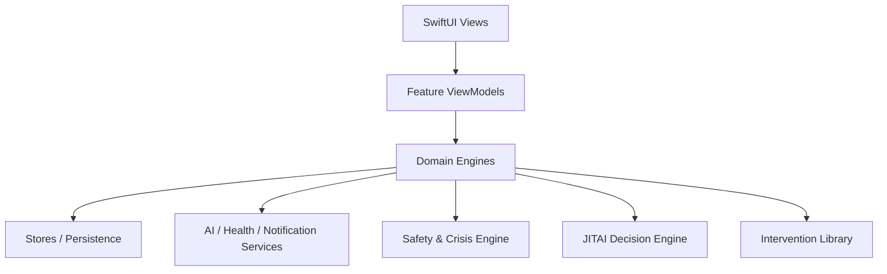

# Lumina Architecture Implementation Plan

Source research:
- `/Users/yifan/Downloads/Lumina 融合用户健康传感数据的理论与实现深度研究报告.pdf`
- `/Users/yifan/Downloads/Lumina（AI Emotional Support Web App）理论支撑与产品化研究报告.pdf`

## Goal

Move Lumina from a set of feature screens into a safer, testable emotional-support system:

- Explicit conversation state machine instead of free-form chat only.
- Safety and crisis routing before model generation.
- Modular intervention library for listening, coaching, planning, grounding, and follow-up.
- JITAI-ready decision layer for future HealthKit and sensor-driven support.
- Stores and feature view models that replace one oversized global `AppState`.
- Privacy controls and evaluation hooks as product features, not only policy text.

## Target Architecture

## Implementation Phases

### Phase 1: Safety and Conversation Foundation

- [x] Add domain models: `ConversationState`, `UserIntent`, `RiskLevel`, `InterventionKind`, `MicroPlan`.
- [x] Add a local safety triage engine that runs before every AI call.
- [x] Add explicit crisis route copy and local resource placeholders.
- [x] Persist session-level state and last risk level.
- [x] Keep current UI intact while the new domain layer is introduced.

### Phase 2: Therapy State Machine

- [x] Route each message through `ConversationEngine`.
- [x] Split chat into Listen / Coach / Plan modes.
- [x] Add fallback path for unclear input.
- [x] Add visible session boundary/disclaimer entry point.
- [x] Add structured turn metadata for later evaluation.

### Phase 3: Store Split

- [x] Split `AppState` into navigation root plus feature stores.
- [x] Create `ChatStore`, `JournalStore`, `GardenStore`, `ProfileStore`.
- [x] Move Garden state out of root app state.
- [x] Move chat sessions out of root app state.
- [x] Keep migration backward-compatible for current in-memory demo data.

### Phase 4: Intervention Library

- [x] Define intervention scripts for reflective listening, affect labeling, grounding, breathing, If-Then planning, and wrap-up.
- [x] Wire Sanctuary to the same intervention library.
- [x] Wire Garden quests to completed micro-plans and behavior-change actions.
- [x] Add follow-up prompts and next-day check-in.

### Phase 5: HealthKit MVP

- [x] Add HealthKit permission screen and plain-language data-use explanation.
- [x] Read daily sleep/activity/heart-rate summaries only.
- [x] Store aggregated features, not raw high-frequency samples.
- [x] Add baseline model for 14-30 day personal ranges.
- [x] Add data control panel: revoke, delete, sync timestamp.

### Phase 6: JITAI v1

- [x] Add `JITAIDecisionEngine` with rules, confidence, and reason codes.
- [x] Add fatigue controls: max daily prompts, quiet hours, refusal suppression.
- [x] Deliver decisions as in-app cards first, notifications later.
- [x] Add "Why am I seeing this?" explanation for every prompt.

### Phase 7: Evaluation and Governance

- [x] Add intervention logs with reason, confidence, user response, and outcome.
- [x] Add minimal check-in metrics: 0-10 mood/stress and optional note.
- [x] Add safety metrics: crisis route count, false positive feedback, user control actions.
- [x] Add A/B hooks for prompt policy versions.
- [x] Document red-team and rollback procedure.

### Phase 8: Local Persistence

- [x] Add schema-versioned local JSON state file under Application Support.
- [x] Make core domain models Codable.
- [x] Add store restore/snapshot interfaces.
- [x] Load state on `AppState` startup.
- [x] Debounce-save store changes to disk.

### Phase 9: Notification Foundation

- [x] Add local notification service using iOS `UserNotifications`.
- [x] Connect Profile Daily Reminder to permission request, schedule, and cancel.
- [x] Persist notification permission/scheduling status.
- [x] Show notification status and blocked-permission guidance in Profile.
- [x] Keep JITAI push notifications disabled until prompt-governance rules are ready.

### Phase 10: JITAI Notification Scheduler

- [x] Add opt-in Smart Suggestions notification setting.
- [x] Schedule only the active JITAI decision that already passed local relevance and fatigue rules.
- [x] Reuse JITAI quiet hours, daily cap, dismissal suppression, and expiry checks before any notification is queued.
- [x] Deduplicate scheduled JITAI notifications by decision ID.
- [x] Cancel pending JITAI notifications when the user accepts, dismisses, suppresses, or disables Smart Suggestions.
- [x] Log scheduled JITAI notifications with policy version and reason codes.

### Phase 11: Wellbeing Context Fusion

- [x] Add `WellbeingContextEngine` to merge check-ins, journal signals, Health summaries, Garden progress, and follow-ups.
- [x] Keep the context snapshot derived from existing local data instead of adding another persisted source of truth.
- [x] Surface the current context on Home with confidence, signal sources, and a non-diagnostic caveat.
- [x] Let JITAI consider today's explicit check-in before passive Health/Garden signals.
- [x] Add reason-code copy for check-in driven JITAI prompts.

### Phase 12: JITAI User Controls

- [x] Expose Smart Suggestions daily cap in Profile.
- [x] Expose Smart Suggestions quiet-hours start and end in Profile.
- [x] Persist JITAI preference changes through the existing JITAI store snapshot.
- [x] Record JITAI preference changes as user-control governance events.
- [x] Reconcile pending JITAI notifications when preferences invalidate the active decision.

### Phase 13: Context-Aware Therapy Prompting

- [x] Convert fused wellbeing context into a minimal Therapy prompt brief.
- [x] Include only user-visible derived context, never raw Health samples.
- [x] Add prompt rules that context is uncertain, non-diagnostic, and used only for tone/intervention selection.
- [x] Log context reason codes into Therapy turn metadata when the brief is used.
- [x] Fix Therapy prompt history so the latest user message is not duplicated.

### Phase 14: Notification Response Routing

- [x] Add `UNUserNotificationCenterDelegate` at app launch.
- [x] Route daily reminder taps to Home.
- [x] Route JITAI notification taps to the decision destination tab.
- [x] Treat active JITAI notification taps as accepted JITAI decisions.
- [x] Log notification opens as user-control governance events.

### Phase 15: Domain Tests and Regression Harness

- [x] Add a `LuminaTests` XCTest target.
- [x] Add safety routing regression coverage for high-risk messages.
- [x] Add JITAI quiet-hours, daily-cap, and explicit-check-in priority regression tests.
- [x] Add wellbeing context brief privacy coverage so prompt context stays derived and non-raw.
- [x] Add persisted notification state migration coverage for older JSON snapshots.
- [x] Verify the test suite with `xcodebuild test`.

### Phase 16: Garden Game Loop Foundation

- [x] Add daily forage items as a lightweight map interaction beyond watering.
- [x] Persist and restore forage items with backward-compatible garden state decoding.
- [x] Let players tap hidden dew motes in the Garden world to collect dew.
- [x] Add a Garden quest that rewards collecting the daily dew motes.
- [x] Add regression tests for forage generation, claiming, and old garden state migration.

### Phase 17: Garden Daily Visitor Events

- [x] Add a persisted daily visitor event model with deterministic per-day generation.
- [x] Add visitor task types for gathering dew and tending a plot.
- [x] Render the active visitor directly in the Garden map.
- [x] Add a visitor sheet with accept, progress, dismiss, and reward-claim states.
- [x] Add regression tests for visitor event generation, acceptance, completion, reward, and old garden state migration.

### Phase 18: Garden Keepsake Unlocks

- [x] Add a persisted keepsake collection model.
- [x] Unlock a visitor-specific keepsake when a daily visitor request is completed.
- [x] Prevent duplicate keepsake unlocks for repeated visitor rewards.
- [x] Render unlocked keepsakes directly in the Garden world.
- [x] Show the keepsake reward in the visitor request sheet.
- [x] Add regression tests for keepsake unlock and duplicate prevention.

### Phase 19: Garden Map Area Unlocks

- [x] Add a persisted map area unlock model.
- [x] Unlock a map area from the visitor keepsake reward path.
- [x] Prevent duplicate map area unlocks for repeated keepsake rewards.
- [x] Render opened Garden areas directly in the world scene.
- [x] Show the area unlock reward in the visitor request sheet.
- [x] Add regression tests for area unlock, duplicate prevention, and old garden state migration.

### Phase 20: Garden Map Area Interactions

- [x] Add persisted daily map area visit state.
- [x] Make unlocked map areas tappable Garden entry points.
- [x] Add once-per-day area actions with dew rewards.
- [x] Show area action sheets and completed-today state.
- [x] Add regression tests for locked-area blocking, daily reward, duplicate prevention, next-day reset, and old garden state migration.

### Phase 21: Garden Area Milestone Chains

- [x] Add milestone definitions for each unlockable Garden area.
- [x] Persist unlocked area milestones with backward-compatible garden state decoding.
- [x] Advance area milestone chains from daily area actions.
- [x] Add one-time milestone dew rewards without allowing duplicate same-day rewards.
- [x] Show area chain progress, next milestone, completed stage pills, and total reward feedback in the Garden area sheet.
- [x] Add regression tests for milestone threshold unlocks, duplicate prevention, and old garden state migration.

### Phase 22: Garden Area Visual Unlocks

- [x] Render completed area stages directly on the Garden map.
- [x] Add distinct visual stage marks for Path Nook, Lantern Glade, and Archive Corner.
- [x] Show completed-stage pips on area nodes.
- [x] Keep visual unlocks non-blocking and tied to persisted milestone state.
- [x] Add regression coverage for stable, ordered milestone definitions.

### Phase 23: Garden Area Mini-Games

- [x] Add a distinct mini-game type for each unlockable Garden area.
- [x] Replace immediate area reward claiming with a short area-specific interaction.
- [x] Add Path Nook route stepping, Lantern Glade light toggles, and Archive Corner seed cards.
- [x] Gate daily area reward claiming until the mini-game is complete.
- [x] Preserve existing daily visit, milestone, and reward persistence semantics.
- [x] Add regression coverage for stable mini-game assignments.

### Phase 24: Garden Mini-Game Feedback

- [x] Add a completion-ready state inside area mini-games.
- [x] Show a reduced-motion-aware ready ribbon after a mini-game is complete.
- [x] Show a map-positioned dew reward burst after claiming an area reward.
- [x] Auto-clear transient reward feedback without persisting animation state.
- [x] Preserve existing daily visit, milestone, and reward logic.

### Phase 25: Garden Area Quest Chapters

- [x] Add area quest definitions that track each area's milestone chain.
- [x] Give each area chapter a title, objective, story beat, visit requirement, and dew reward.
- [x] Upgrade the area sheet from generic chain progress to an active quest card.
- [x] Keep quest progress derived from existing daily visits and milestones instead of adding duplicate persistence.
- [x] Add regression coverage to keep quest definitions aligned with milestone requirements.

### Phase 26: Garden Area Map Evolution

- [x] Add map evolution definitions for each area quest chapter.
- [x] Render completed area chapters as larger map-level scene changes.
- [x] Add distinct Path Nook trail stones, Lantern Glade glow lines, and Archive Corner catalog platform visuals.
- [x] Keep map evolution derived from existing milestone unlocks instead of adding duplicate persistence.
- [x] Add regression coverage for stable evolution stages, scale, and safe local offsets.

### Phase 27: Garden Area Logbook

- [x] Add derived Garden area log entries from unlocked areas, visits, and milestones.
- [x] Show an Area Logbook inside the Quest Board.
- [x] Include locked area placeholders, visit counts, completed chapter counts, and next chapter objectives.
- [x] Let unlocked logbook cards open their matching Garden area sheet.
- [x] Add regression coverage for log entry unlock state, visit summary, completed chapters, and next chapter derivation.

### Phase 28: Garden Chapter Memories

- [x] Add derived chapter memories for completed area quest chapters.
- [x] Include each memory's chapter story and matching map evolution description.
- [x] Make completed chapter markers in the Area Logbook tappable.
- [x] Show an inline memory card with the chapter visual, story, and map change.
- [x] Add regression coverage for memory story and map-change derivation.

## Current Progress

- [x] Garden has a basic resource loop: dew, quests, building, and persistent in-memory decorations.
- [x] Architecture plan saved in repo.
- [x] Conversation domain model added.
- [x] Local safety triage added.
- [x] Chat send flow routed through safety triage.
- [x] Build verified after initial safety/state-machine foundation.
- [x] Add visible Therapy safety boundary and support disclaimer.
- [x] Therapy chat now has explicit Listen / Coach / Plan mode selection.
- [x] Gemini prompts now receive mode-specific support policy and safety boundary instructions.
- [x] Unclear input routes through fallback clarification policy.
- [x] Chat sessions now store turn metadata for later evaluation and JITAI/Garden integration.
- [x] Build verified after Phase 2 state-machine implementation.
- [x] App state split into `ChatStore`, `JournalStore`, `GardenStore`, and `ProfileStore` behind a compatibility facade.
- [x] Build verified after Phase 3 store split.
- [x] Shared `InterventionLibrary` added for Therapy prompt policy and Sanctuary cards.
- [x] Build verified after intervention library foundation.
- [x] Therapy If-Then micro-plans can create Garden habits and a Garden quest.
- [x] Build verified after Therapy-to-Garden micro-plan integration.
- [x] Follow-up model and store added.
- [x] Therapy micro-plans now schedule next-day follow-ups.
- [x] Home and Garden Quest Board can record follow-up outcomes: done, later, or too hard.
- [x] Follow-up completion syncs back to the linked Garden habit.
- [x] Build verified after follow-up loop.
- [x] HealthKit service added for daily aggregate sleep, activity, and heart-rate summaries.
- [x] Health baseline model added for personal 14-30 day ranges.
- [x] Profile now includes Health context connection, sync status, local delete, and revoke instructions.
- [x] Build verified after Phase 5 HealthKit MVP.
- [x] JITAI v1 store added with local rules for reflection, grounding, recovery, movement, and Garden actions.
- [x] Home now shows an explainable JITAI card with accept, dismiss, and quiet-today controls.
- [x] JITAI prompt fatigue controls added: daily cap, quiet hours, dismissal suppression, and suppression until next morning.
- [x] Build verified after Phase 6 JITAI v1.
- [x] Evaluation store added for intervention logs, daily check-ins, safety events, and prompt policy versions.
- [x] Therapy, JITAI, follow-ups, and data-control actions now write evaluation/governance events.
- [x] Home includes a 0-10 mood/stress check-in with optional note.
- [x] Profile includes governance metrics and false-positive safety feedback.
- [x] Red-team and rollback procedure documented in `docs/lumina_red_team_rollback.md`.
- [x] Local persistence added for chat sessions, journal entries, Garden, follow-ups, Health summaries, JITAI, evaluation logs, and profile settings.
- [x] Build verified after Phase 8 local persistence.
- [x] Local daily check-in notifications added behind the existing Profile reminder setting.
- [x] Build verified after Phase 9 notification foundation.
- [x] Opt-in JITAI Smart Suggestions notifications added with local governance and deduplication.
- [x] Wellbeing context fusion added as a local derived snapshot and visible Home card.
- [x] JITAI daily cap and quiet-hours controls added to Profile.
- [x] Therapy prompts now receive a minimized non-diagnostic context brief when local signals exist.
- [x] Notification tap routing added for daily reminders and JITAI Smart Suggestions.
- [x] Domain regression test target added with nineteen passing tests for safety, JITAI, wellbeing context, notification migration, and Garden loops.
- [x] Garden now has a daily forage loop with tappable dew motes and tested persistence migration.
- [x] Garden now has a daily visitor request loop with accept, progress, dismiss, and reward states.
- [x] Garden visitor requests now unlock persistent map keepsakes.
- [x] Garden keepsakes now open persistent map areas.
- [x] Garden map areas are now tappable daily interaction entry points.
- [x] Garden map areas now have persistent milestone chains.
- [x] Garden milestone progress now changes the map visually.
- [x] Garden area rewards now require completing a short area-specific mini-game.
- [x] Garden mini-games now provide completion and reward feedback animations.
- [x] Garden map areas now present active quest chapters tied to milestone progress.
- [x] Garden quest chapter completion now visibly evolves the map scene.
- [x] Garden Quest Board now includes an Area Logbook for unlocked and locked map areas.
- [x] Garden Area Logbook now exposes completed chapter memories with story and map-change details.
- [x] Journal Timeline now supports search, mood filters, clearer summary metrics, empty states, and delete confirmation.
- [x] Sanctuary now includes a quick reset entry point, clearer support cards, safer affirmation fallback, and breathing timer cleanup.
- [x] Root navigation now uses a cohesive image-generated Lumina PNG icon family, native TabBar styling, and a Home badge for active follow-ups.

## Current Implementation Notes

- Keep changes incremental. Do not split large views before a compiled domain layer exists.
- `AppState` still exposes compatibility properties so existing views do not need a risky all-at-once rewrite.
- Garden currently imports only explicit If-Then plans from Therapy to avoid accidental task creation from normal emotional disclosure.
- Follow-ups are visible before their due date as a queued check-in, then can be completed, snoozed, or marked too hard.
- Health data is stored as daily aggregates only and must be interpreted as uncertain context, not diagnosis.
- Wellbeing context is derived at read time from persisted local sources; it should not become a second editable state.
- Health permissions are controlled by iOS; Lumina offers sync status, local aggregate deletion, and explicit revoke instructions.
- Therapy can use wellbeing context only as an uncertain tone/intervention hint. Do not send raw Health samples or make diagnostic claims.
- JITAI v1 remains local-rule based. Smart Suggestions notifications are opt-in and can only schedule an active decision produced by the same in-app rules.
- JITAI should prefer explicit self-report check-ins over passive Health signals when both are available.
- JITAI preference edits should immediately refresh active decisions and cancel stale pending notifications.
- Notification scheduling currently supports one daily check-in reminder plus opt-in JITAI Smart Suggestions with explicit quiet hours, daily cap, expiry, and suppression logic.
- Notification response routing should preserve user intent: active JITAI notification taps count as accepting that suggestion.
- Keep domain logic covered before widening UI/Garden changes; every new passive prompt or control should add or update a domain regression test.
- Area visits are intentionally once per day; deeper area-specific quest chains should build on this visit model.
- Area milestones are one-time rewards; future area quests should append new stages instead of mutating completed milestone ids.
- Area visual unlocks should stay readable at phone size and must not cover plot buttons or core controls.
- Area mini-games are intentionally short and local-only for now; persistence remains tied to the daily area visit result.
- Mini-game animation state is intentionally transient UI state; do not persist it or mix it with daily visit state.
- Area quest chapters are derived from milestone definitions; do not add separate quest progress persistence unless the quest can branch independently.
- Map evolution is derived from completed area milestone stages; keep decorative offsets bounded so plot buttons and core controls remain tappable.
- Area Logbook entries are derived summaries. Do not persist them separately unless users can edit notes or labels.
- Chapter memories are derived from completed quests plus map evolution definitions; keep them read-only until user-authored notes exist.
- Journal Timeline filters are transient UI state. Keep journal entry persistence unchanged unless users can save custom views or labels.
- Sanctuary quick reset actions are direct UI affordances over existing local intervention scripts; keep crisis actions explicit and user-initiated.
- Root navigation should stay on native `TabView`; extend the Lumina raster PNG asset family instead of mixing unrelated SF Symbols for primary app destinations.
- Garden should evolve through small tested loops: forage, tend, build, quest, then NPC/story events. Avoid adding large visual-only changes without mechanics.
- Daily visitors should remain lightweight and local for now; use them to create variety before adding complex story branches.
- Keepsakes are currently collection rewards, not spendable resources. Use them next as prerequisites for map area unlocks or deeper visitor chains.
- Map areas are currently visual unlocks. Next, make each area an interaction entry point with its own quests or visitor chain.
- Persistent state currently uses Codable JSON for fast iteration. Move to SQLite/Core Data only after the domain model stabilizes and query needs are clearer.
- Crisis routing should be conservative and local-first.
- Every future passive prompt needs user control: frequency cap, quiet hours, and dismiss/suppress behavior.
